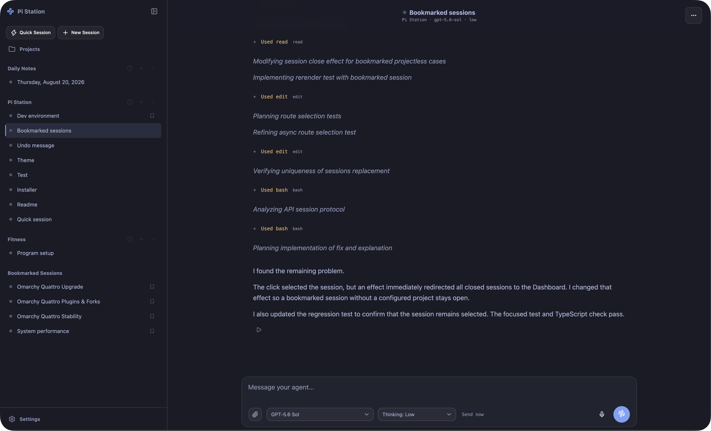

# Pi Station

Pi Station is a Workspace UI for Pi that runs on your computer. You can use it on that computer or connect to it from other devices, including phones and other computers. It uses the public Pi SDK directly. Pi owns Session files, history, model settings, and runtime metadata. Pi Station stores only its application metadata.



> [!WARNING]
> Pi Station is a new, pre-1.0 project. Expect defects, incomplete platform coverage, and breaking changes to installation, configuration, application metadata, and APIs. Back up important data before an update and review release notes before you install a new version.

## Production architecture

There is one production path:

- `apps/web/`: the only Workspace UI.
- `apps/server/`: the loopback HTTP server and SDK Session runtime.
- `packages/application-protocol/`: the normalized application contract. Stable HTTP endpoints remain under `/v2/**`.
- `~/.local/share/pi-station`: Pi Station application data.
- `~/.local/share/pi-station/shared`: Session shared files.
- `pi-station.service`: the only application service.

## Development

Use Node.js 22.19 or newer and npm 10 or newer.

```bash
npm install
npm run dev:server
npm run dev:workspace
```

For isolated work, use `npm run dev:isolated`. It uses port 8811 and `~/.local/share/pi-station-dev`. The Workspace uses `VITE_PI_STATION_API` when its API is on another origin.

## Build and validation

```bash
npm run build
npm run check
```

## Install Pi Station

Pi Station requires Node.js 22.19 or newer and `curl`. Linux also requires a systemd user manager.

Pi Station uses the embedded Pi SDK to connect model providers. On first use, select a provider and sign in with OAuth or an API key. Credentials use Pi's standard `~/.pi/agent/auth.json` store through the SDK. An existing Pi CLI configuration for the same user remains compatible, but the CLI is optional and is intended for advanced use.

Install the latest release on Linux or macOS with one command:

```bash
curl -fsSL https://raw.githubusercontent.com/Quantum-Fire-Labs/pi-station/master/install-release.sh | bash
```

The bootstrap installer detects the operating system and architecture, downloads the matching GitHub release and checksum, verifies the archive, and runs the platform installer. To inspect the script before you run it:

```bash
curl -fsSLO https://raw.githubusercontent.com/Quantum-Fire-Labs/pi-station/master/install-release.sh
less install-release.sh
bash install-release.sh
```

Set `PI_STATION_VERSION` to install a specific release, for example:

```bash
PI_STATION_VERSION=0.1.2 bash install-release.sh
```

### Edge channel

The opt-in edge channel contains the latest validated build of `master`. Each build uses an immutable internal version such as `0.1.1+089fb93`, installs below the normal versioned application directory, and retains the installed previous version for rollback. Edge builds can contain unstable changes.

To update manually to the current edge build:

```bash
curl -fsSL https://raw.githubusercontent.com/Quantum-Fire-Labs/pi-station/master/install-release.sh | PI_STATION_CHANNEL=edge bash
```

The edge workflow builds and checks native Linux and macOS artifacts for x64 and ARM64 after changes reach `master`. It publishes `pi-station-edge-version.json` with the same immutable version stored in each archive's `VERSION` file. An older edge release without this metadata remains installable, but Settings reports its latest version as unavailable instead of guessing.

## Update Pi Station

Before updating, back up important data and review the release notes. Wait for active Sessions to finish, then use either the built-in updater or the platform command below. Both methods preserve the existing port, data directories, and public and local origins. If health validation fails, the installer restores the previous release and service configuration.

### Update from Settings (Linux and macOS)

Open **Settings > Pi Station Update**, select the stable or edge channel, and choose **Update Pi Station**. Pi Station never installs updates automatically and does not create an update timer.

The selected channel is stored in `update-settings.json` under the Pi Station data directory, separately from provider credentials. The updater checks GitHub's latest release for stable builds and immutable release metadata for edge builds. It runs the installer in a detached systemd user service on Linux or launchd job on macOS, so the update continues while Pi Station restarts.

The Settings updater requires a supported release installation. A source checkout can display version information but cannot update itself.

### Update manually on Linux

Run the release bootstrap installer again to update to the latest stable release:

```bash
curl -fsSL https://raw.githubusercontent.com/Quantum-Fire-Labs/pi-station/master/install-release.sh | bash
```

To update to the latest edge build instead:

```bash
curl -fsSL https://raw.githubusercontent.com/Quantum-Fire-Labs/pi-station/master/install-release.sh | PI_STATION_CHANNEL=edge bash
```

The installer waits for active turns, switches the release, restarts only `pi-station.service`, validates service health, and confirms that Pi process IDs did not change.

### Update manually on macOS

Run the release bootstrap installer again to update to the latest stable release:

```bash
curl -fsSL https://raw.githubusercontent.com/Quantum-Fire-Labs/pi-station/master/install-release.sh | bash
```

To update to the latest edge build instead:

```bash
curl -fsSL https://raw.githubusercontent.com/Quantum-Fire-Labs/pi-station/master/install-release.sh | PI_STATION_CHANNEL=edge bash
```

The installer waits for active turns, switches the release, restarts only the `works.pistation.server` LaunchAgent, and validates service health.

### Tailnet access on Linux

Pi Station can use Tailscale Serve for private HTTPS access from authorized devices on the same tailnet. The setup keeps Pi Station bound to loopback and does not use Tailscale Funnel. A connected Pi Station client can ask tools to act with the host user's authority, so restrict tailnet membership and access controls accordingly.

Install and connect Tailscale first. Then run the opt-in setup:

```bash
curl -fsSL https://raw.githubusercontent.com/Quantum-Fire-Labs/pi-station/master/setup-tailscale.sh | bash
```

The script reads the installed Pi Station port and the machine's MagicDNS name, updates the canonical installed HTTPS origin, restarts only Pi Station, configures Tailscale Serve, and validates both local and tailnet access. If validation fails, it restores the prior Pi Station and Tailscale Serve configuration. It refuses to replace an unrelated route on HTTPS port 443.

If port 443 is already assigned, choose an unused HTTPS port explicitly:

```bash
curl -fsSL https://raw.githubusercontent.com/Quantum-Fire-Labs/pi-station/master/setup-tailscale.sh |
  PI_STATION_TAILSCALE_HTTPS_PORT=8443 bash
```

Inspect the configuration and service:

```bash
tailscale serve status
systemctl --user status pi-station.service
journalctl --user -u pi-station.service
```

For a headless machine that must continue running after logout, enable the systemd user manager for the account:

```bash
loginctl enable-linger "$USER"
```

The helper currently supports Linux installations. It does not install Tailscale, change tailnet access controls, enable Funnel, or configure automatic updates.

### Linux

The installer creates `pi-station.service` as a user service. It installs application files below `~/.local/share/pi-station/app` and stores application data, including shared Session files, in `~/.local/share/pi-station`. It binds the server to loopback and opens the Workspace at `http://127.0.0.1:8801/workspace`.

See [Update Pi Station](#update-pi-station) for built-in and command-line update instructions.

Configuration is in `~/.config/pi-station/environment`. View service logs with:

```bash
journalctl --user -u pi-station.service
```

To remove the service without removing Session or application data:

```bash
systemctl --user disable --now pi-station.service
rm ~/.config/systemd/user/pi-station.service
systemctl --user daemon-reload
```

### macOS

The installer creates the `works.pistation.server` LaunchAgent. Application files and data are below `~/Library/Application Support/Pi Station`. Logs are in `~/Library/Logs/Pi Station`. The server binds to loopback at `http://127.0.0.1:8801`.

See [Update Pi Station](#update-pi-station) for built-in and command-line update instructions.

To remove the LaunchAgent without removing Pi Station data:

```bash
launchctl bootout "gui/$UID/works.pistation.server"
rm ~/Library/LaunchAgents/works.pistation.server.plist
```

### Manual archive installation

Each GitHub release includes platform archives and matching `.sha256` files. Download both files, verify the checksum, extract the archive, and run `install.sh` on Linux or `install-macos.sh` on macOS. This is the auditable alternative to the bootstrap command.

## Build a release artifact

Create a clean artifact and SHA-256 checksum for the current Linux or macOS architecture with:

```bash
npm run release:build -- 0.1.0
```

The files are written to `release/`. Building a release requires the normal development dependencies and `tar`. Linux uses `sha256sum`; macOS uses `shasum`. Build each architecture on its target operating system because production dependencies can contain native code.

To publish a release, update the package version on `master`, complete the required CI checks, and push a matching `v<version>` tag. The release workflow validates and builds Linux and macOS archives on x64 and ARM64 runners. It publishes the GitHub release only after all four archives and their checksums are available.

## Local source deployment

On Linux with a systemd user manager, run `npm run deploy:local` from `master`. This command validates and builds the protocol, server, and Workspace; drains active turns; generates `pi-station.service` from the current checkout and environment; restarts only that service; and checks health and Pi process PIDs.

The deployment supports `PI_STATION_PORT`, `PI_STATION_DATA_DIR`, `PI_STATION_SHARED_ROOT`, `PI_STATION_WEB_ORIGIN`, and `PI_STATION_LOCAL_ORIGIN`. Push notifications also support an optional VAPID contact value in `PI_STATION_VAPID_SUBJECT`. Do not expose the service directly to the public internet.

Do not deploy from a feature worktree. Do not restart Pi processes.

## Data-name migration

The first new server start atomically renames the retired default `~/.local/share/pi-station-rpc-v2` to `~/.local/share/pi-station` only when the canonical directory does not exist. It never merges or replaces directories. A failed rename leaves the retired directory unchanged.

`PI_STATION_DATA_DIR` is canonical. `PI_STATION_RPC_V2_DATA_DIR` is accepted for one deployment boundary only and prints a retirement warning. Set the canonical variable before the next release. For rollback, point the previous release at the directory explicitly; do not copy, merge, or delete Session history.

When the shared-file location still has its retired default, an installation moves it from `~/.pi/agent/pi-station/shared` to the `shared` directory below `PI_STATION_DATA_DIR`. It leaves a compatibility symlink at the retired location. An explicit custom `PI_STATION_SHARED_ROOT` is not moved.

## Open-source audit

`npm run check` starts with an audit that rejects known maintainer-specific paths, hostnames, addresses, and private runtime locations from tracked files. Run it before each public release.

## Security

The server binds to loopback. Do not expose it to the public internet. A connected client can ask Pi to use tools with the host user's authority.

## Contributing and security

Read [CONTRIBUTING.md](CONTRIBUTING.md) before you submit a change. Report suspected vulnerabilities through the private process in [SECURITY.md](SECURITY.md), not through a public issue.

## License

[MIT](LICENSE)
